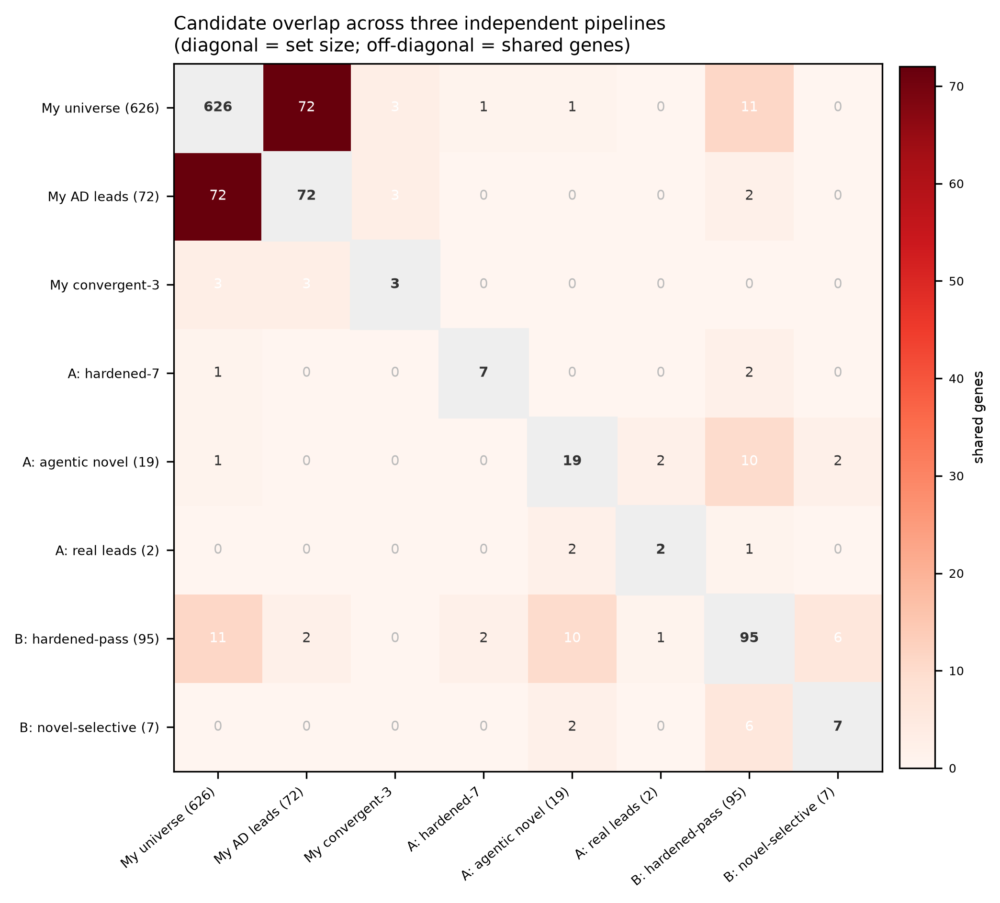

# Reconciled view: selective Th2 suppressors, three ways

**A reconciliation of three independent re-analyses of the Zhu & Dann et al. 2025 genome-scale
CRISPRi Perturb-seq screen in primary human CD4⁺ T cells — and an honest joint conclusion.**

This document positions three analyses of the same question against each other:

| # | Analysis | Author | Core move | Verdict |
|---|----------|--------|-----------|---------|
| **1** | `th2-selective-suppressors/` | Shiven | 2-arm decomposition + **statistical hardening** + agentic mechanism review | **calibrated negative** |
| **2** | `th2-independent-replication/` | Shiven | independent from-scratch pipeline, **remote-streaming**, matched Th1-vs-Th0 arm | **calibrated negative (concordant)** |
| **3** | `ad-offaxis-druggability/` | this work (Claude Science) | **AD patient-validation + druggability layer** on the selective candidates | **orthogonal axis, not a rescue** |

The honest headline is stated up front, because it is the most important result:

> **The naive "selective Th2 suppressor" atlas does not survive rigorous statistics — and adding a
> patient-validation + druggability layer on top of it does not change that.** Two independent
> statistical pipelines both collapse the apparent signal, and the candidate lists from all three
> analyses barely overlap. That non-convergence is itself the strongest evidence that single-gene
> selective Th2 suppression is not established by this screen. What is genuinely useful is the
> *machinery* each analysis built — hardening, streaming, agentic review, patient-validation — and a
> small, honestly-caveated set of leads to take to a functional assay.

---

## 1. What each analysis did

### Analysis 1 — selective-suppressor atlas + hardening (Shiven)

Started from the same premise as the project's original atlas: the paper's single bidirectional
Th2−Th1 axis cannot separate a **selective Th2 suppressor** (KD lowers Th2, leaves Th1 flat — the
allergy target) from a **Th1-skewer** (KD just flips the cell toward Th1). A 2-arm decomposition
(Th2-up arm and Th1-up arm of the Ota 2021 signature) can. The initial read looked promising —
GATA3 top, ~127 selective hits.

**Then it ran the statistics honestly, and the conclusion inverted:**
- Competitive **rank-based scoring** collapsed the arm correlation **+0.54 → +0.18** — most of the
  "global-magnitude confound" was a scoring artifact of mean-of-z.
- A **permutation null** showed the selective set (420 under competitive scoring) is **not enriched
  over random gene sets** of the same size (empirical FDR ≈ 1.25) — because Th1/Th2 are genuinely
  reciprocal.
- With a **matched Th1-vs-Th0 arm, GATA3 reads as a Th1-skewer** (KD drives Th1 to +2.8), exactly as
  canonical biology predicts (GATA3 loss de-represses T-bet). The "top selective hit" was an
  artifact.
- Only **7 genes** pass the strict multi-arm + concordance gate, and none are credible at FDR ≥ 1.

It also ran an **agentic mechanism-dossier layer**: for the top 10 novel candidates, an investigator
agent proposed a mechanistic route to the Th2 program and a skeptic agent adversarially checked every
citation. Two (**ARNT, ELAVL1**) came back `investigator: plausible` — but all were downgraded to a
final post-adversarial verdict of `uncertain` or worse; the rest were housekeeping / global-effect
false positives. The mechanism layer performed the triage the numeric score could not.

### Analysis 2 — independent replication (Shiven)

A **from-scratch second pipeline**, different tooling, same question — the strongest kind of check.
Its notable engineering contribution is a **pure remote-streaming approach**: it reads the 16.8 GB
public-S3 DE matrix over HTTP byte-ranges, pulling only the ~50 MB of rows it needs rather than
downloading the file. A **GATA3 alignment guardrail** caught a silent arm↔annotation row-order
scramble (0.9 % overlap) before it poisoned the analysis.

**It independently reaches the same negative:** under a clean matched Th1-vs-Th0 arm, GATA3 is again a
Th1-skewer (≈ +2.8 SD), not a selective suppressor. 95 genes pass its hardening gate, 7 classed
`novel_selective`.

### Analysis 3 — AD off-axis patient-validation + druggability (this work)

Took the project's selective candidates and asked a *different* question, from a pharma-researcher
brief: focus on **atopic dermatitis**, go **off the IL-4Rα–STAT6 axis** (dupilumab's crowded
pathway), **validate in patient skin single-cell data**, and layer **druggability**. It classified
the candidates by STRING proximity to the IL-4R/STAT6 spine, re-scored genetics against AD-specific
EFO terms, measured T-cell-resolved lesional-vs-healthy expression in a 280k-cell AD skin atlas, and
graded tractability from Open Targets. It produced 3 fully-convergent AD leads (NR4A3, MAP3K14,
PTPA) and a 72-gene shortlist.

**This is an orthogonal evidence axis (disease-tissue expression + druggability), not a statistical
re-hardening — so it cannot, by construction, rescue a candidate that fails the hardening in
analyses 1 & 2.** That is the crux of the reconciliation.

---

## 2. The reconciliation: the candidate lists barely overlap

If single-gene selective Th2 suppression were a robust signal, independent analyses would converge on
the same genes. They do not. Across the eight candidate sets from the three analyses:

The decisive numbers (`reconciliation_overlaps.csv`):

- **My 72 AD patient-validated leads ∩ Analysis-1 hardened-7: 0 genes.**
- **My 3 convergent AD leads (NR4A3, MAP3K14, PTPA) ∩ any of their hardened/agentic sets: 0.**
- **Even the two independent *hardened* sets agree on almost nothing:** Analysis-1's 7 survivors and
  Analysis-2's 95 survivors share only **2 genes (RABEPK, BRPF1)**.
- The one cross-pipeline agreement worth noting is **ARNT** — it is both an Analysis-1 agentic
  real-lead *and* in Analysis-2's hardened-pass set (its dossier: HIF-1β, a plausible-but-uncertain
  Th2 route).

Three independent analyses producing three almost-disjoint candidate lists is not a failure of any
one pipeline — it is the empirical signature of a **fundamentally underpowered / non-existent
single-gene effect** sitting on top of genuine Th1/Th2 reciprocity. This corroborates the
calibrated-negative from the inside.

---

## 3. Constructive synthesis: the druggability + patient layer, applied to *their* survivors

The fair way to combine the analyses is to put them on **common footing** — take the genes that
survived the statistical hardening (Analyses 1 & 2, 102 genes union) and run *my* orthogonal layer
(druggability + AD genetics + patient expression) on exactly those. Result
(`their_survivors_common_footing.csv`):

- **Druggability is not the bottleneck:** 49 / 102 statistically-hardened survivors are
  pharmacologically tractable (small-molecule or antibody).
- **But they are disconnected from AD human genetics:** only **1 of 102** carries an AD
  genetic-association ≥ 0.3 — **GATA3** — and GATA3 is precisely the gene *both* hardening pipelines
  flagged as a **Th1-skewer, not a selective suppressor** (and it is an undruggable TF, tractability
  0). So the single survivor with disease-genetic support is the discredited hit.
- **Patient expression, where measurable:** of the 5 survivors that overlap my patient-validation
  table, 4 are upregulated in AD lesional T cells (ATP2C1, C2CD5, P2RY8, CBX5) — but none has AD
  genetic support, and all trace to a single hardening pipeline.

The synthesis therefore **reinforces rather than overturns the negative**: the intersection of
"statistically robust," "druggable," "genetically tied to AD," and "up in patient T cells" is
effectively empty. That is a clean, decision-useful result for a drug-discovery team — it says *do
not start a program off this screen alone*, and it says exactly which orthogonal evidence each
candidate is missing.

> **Data caveat.** The patient-expression axis on the survivors is partial: the CELLxGENE AD-atlas
> CDN throttled the file to ~0.1 MB/s for this session after the first pull, so full T-cell
> expression was computed for the 5 survivors already in the prior 217-gene validation, not all 102.
> The druggability + AD-genetics columns are complete for all 102. This does not affect the
> reconciliation conclusion (which rests on the genetics + hardening overlap), but the patient column
> should be completed before the common-footing table is used for ranking.

---

## 4. What actually holds up (the real deliverables)

None of the three analyses delivers a validated drug target — and all three say so. What they
deliver, jointly, is a **methods stack for doing this honestly**:

1. **Statistical hardening that changes conclusions** (Analysis 1) — competitive scoring +
   permutation FDR + matched vs-Th0 arms, which turned an apparent 127-gene atlas into a calibrated
   negative and correctly re-classified GATA3.
2. **Independent replication** (Analysis 2) — a second from-scratch pipeline reaching the same
   negative, plus a remote-streaming reader for 16.8 GB matrices and a row-order guardrail.
3. **An agentic investigate→verify mechanism-review layer** (Analysis 1) — adversarially-sourced
   dossiers that triage real biology from sick-cell artifacts.
4. **An orthogonal patient-validation + druggability layer** (Analysis 3) — disease-tissue
   single-cell expression + Open Targets tractability + AD-specific genetics, and the discipline to
   report that this layer *cannot* rescue a statistically-failed candidate.
5. **A cross-pipeline reconciliation** (this document) — quantifying that three independent analyses
   do not converge, which is the honest capstone.

**The genuine leads, fully caveated:** if anything is worth a functional IL-4/5/13 readout, it is the
handful that appears in more than one frame — **ARNT** (Analysis-1 agentic + Analysis-2 hardened;
HIF-1β mechanism, plausible-uncertain) above all — and, on the AD-tissue axis alone (not statistically
hardened), NR4A3 / MAP3K14 / PTPA. Every one of these is a hypothesis for a wet-lab assay, not a
target.

---

## 5. Honest limitations (shared across all three)

- **Selectivity ≠ efficacy or safety.** Th2 has protective roles (anti-helminth, barrier integrity).
- **Transcriptomic screen evidence, not in vivo.** These are Rest/Stim CD4⁺ T cells, not a polarized
  differentiation or functional cytokine assay.
- **The decisive missing experiment is the same for all three:** a functional IL-4/5/13 readout plus
  a control-guide-based FDR. No amount of re-scoring public data substitutes for it.
- **Patient upregulation corroborates but does not prove direction** — a gene being up in lesions is
  consistent with, but does not establish, that suppressing it would help.

---

## Files in this reconciliation

- `reconciled_view.md` — this document.
- `reconciliation_sets.csv` — the 8 candidate sets, definitions, verdicts.
- `reconciliation_overlaps.csv` — pairwise overlaps with shared-gene lists.
- `recon_overlap_matrix.png` — overlap heatmap across all pipelines.
- `their_survivors_common_footing.csv` — Analyses 1 & 2 survivors (102) annotated with my
  druggability + AD-genetics + (partial) patient-expression layer.
- The AD layer's own artifacts: `ad_offaxis_target_atlas.csv`, `ad_offaxis_lead_shortlist.csv`,
  `ad_patient_validation.csv`, `ad_target_report.md`, and figures A–C.
